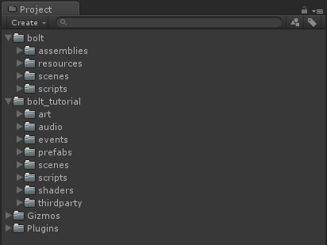
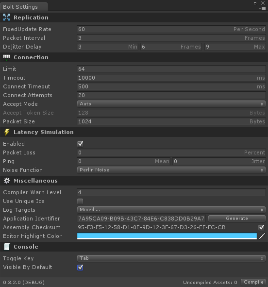
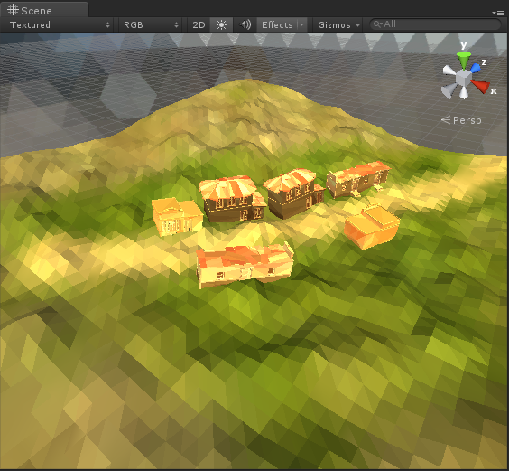

# Chapter 1 - Initial Setup

This tutorial will take you through building a third person shooter game using the Bolt Networking Engine. The game
we are building will feature several complex features which allows us to go through most of what Bolt can do.

 * Authoritative movement, shooting and game logic
 * Replication of animation, transforms and game object state
 * ... **ADD MORE**

## Art

All of the art we are using in this tutorial has either been produced, provided or run through the excellent [https://www.assetstore.unity3d.com/en/#!/content/18572](https://www.assetstore.unity3d.com/en/#!/content/18572 "PolyWorld: Woodland Toolkit")

## Getting Bolt

If you purchased through the Unity Asset Store, the best way to get the latest version of Bolt is by going to [http://www.boltengine.com/AssetStore.aspx](http://www.boltengine.com/AssetStore.aspx) and punching in your asset store invoice number, this lets you always access the latest version of Bolt without having to wait for the Asset Store approval process to catch up.

If you purchased Bolt through our site, you should have been supplied a download link on the return page after your purchase, if you have for some reason lost this link email [support@boltengine.com](support@boltengine.com) to receive a new one. We also send out a link for every release of Bolt to your email. 

## Installing Bolt

Extract the downloaded *Bolt\_VERSION.zip* package to a folder somewhere on your disk and find the .unitypackage file called *Bolt\_VERSION_CompleteWithTutorial.unitypackage*. Create a new unity project and import the package, this will leave you with a directory structure as in the image below.

This package contains an already unpacked and installed version of Bolt, complete with a working version of the entire tutorial in the *bolt\_tutorial* folder. Before we get started with the tutorial, open up the *Bolt Settings* window which you can find at *Window/Bolt Settings* in the top menu.

Most of the settings here we can ignore for now, but look at the bottom *Console* settings and make sure that *Toggle Key* is set to something easily accessible for you, and also that *Visible By Default* is checked. This tells Bolt to always create an in-game console for you when it starts so that we have an easy way to get information from Bolt.   

Create a new folder in the root of your project, I will be calling it *bolt\_tutorial\_mine* throughout this tutorial. 

