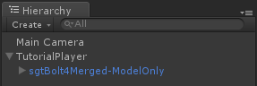

# Chapter 2

Bolt deals with replication in a completely different way compared to most (all?) other networking solutions for Unity. Instead of manually writing code for serializing data, for example using **OnSerializeNetworkView** in the built in Unity networking solution, Bolt lets you define transforms, animations and custom properties for it to automatically replicate over the network - you don't need to write any code what so ever. In fact in this entire tutorial we do not write any type of low level networking code, Bolt handles all of it for you.

## Adding a camera

The first thing we are going to do is just to setup a camera so that we can see what's going on, but instead of just dropping a camera into the scene we will go through Bolt and hook into some of it's callbacks. The finished tutorial comes with an already functioning camera which has all the features we need, and since this tutorial is not about building a third person camera, we are just going to use it verbatim.

You will find the camera prefab in *bolt_tutorial/prefabs/singletons/resources/PlayerCamera* and it's associated script is available in *bolt_tutorial/scripts/player/PlayerCamera.cs*. The camera script inherits from a utility base class defined inside bolt called BoltSingletonPrefab\<T\>, it is used to automatically load a prefab from a *Resources*.

Time to create our first script, in our own tutorial folder create the a script called *TutorialPlayerCallbacks.cs* in the folder *tutorial/Scripts/Callbacks*. 

* Have the class inherit from `BoltCallbacks`
* Apply the `[BoltGlobalBehaviour]` to the class
* Override the `SceneLoadLocalDone` method that is inherited from `BoltCallbacks`
* Inside the `SceneLoadLocalDone` override call `PlayerCamera.Instantiate()` (yes, without any arguments)
* It is very important that you **do not** attach this behavior to any game object in any of your scenes

```csharp
using UnityEngine;

[BoltGlobalBehaviour]
public class TutorialPlayerCallbacks : BoltCallbacks {
  public override void SceneLoadLocalDone(string map) {
	// this just instantiates our player camera, 
	// the Instantiate() method is supplied by the BoltSingletonPrefab<T> class
    PlayerCamera.Instantiate();
  }
}
```


Before we start our game it's probably a good idea to explain exactly what is going on here. What does the `[BoltGlobalBehaviour]` actually do? When Bolt starts, it will find *all* classes which have the `[BoltGlobalBehaviour]` and in some way or another inherit from `MonoBehaviour` (Since `BoltCallbacks` itself inherits from `MonoBehaviour` our own class `TutorialPlayerCallbacks` is also considered as inheriting from `MonoBehaviour`). 

Bolt will then go through the classes it found matching these two conditions and create instances of them automatically for you, so that they exist when Bolt is running and are destroyed when Bolt is shut down. Any instances which are created will be added to the 'Bolt' game object which is automatically created by Bolt on start, and you can clearly see it in your scene hierarchy.

There are a couple of ways to configure how `[BoltGlobalBehaviour]` will act, the first and most simple one is that you can decide if the behaviour in question should run on either the server or client, or both. Specifying nothing like we did for our `TutorialPlayerCallbacks` class means it will run on both the server and client.

```csharp
// only on the server
[BoltGlobalBehaviour(BoltNetworkModes.Server)]

// only on the client
[BoltGlobalBehaviour(BoltNetworkModes.Client)]
```

You can also tell Bolt that a behaviour should only be available during specific scenes, for example our scene is called *Level2* and if we only wanted our behaviour to run during this scene, we could configure the `[BoltGlobalBehaviour]` like this.

```csharp
// only when the current scene is 'Level2'
[BoltGlobalBehaviour("Level2")]

// only when the current scene is 'Level1', 'Level2' or 'Level3' 
[BoltGlobalBehaviour("Level1", "Level2", "Level3")]
```

You can also combine these.

```csharp
// only when we are the server AND the current scene is 'Level2'
[BoltGlobalBehaviour(BoltNetworkModes.Server, "Level2")]

// only when we are the client AND the current scene is 'Level2'
[BoltGlobalBehaviour(BoltNetworkModes.Client, "Level2")]
```

This is an integral part of Bolt as it allows you to easily define behaviour that is global to the entire application or an entire scene, without having to manually fiddle around with passing a game object marked with `DontDestroyOnLoad` around through all of your scenes. Like we mentioned before it is **paramount** that you do not under any circumstance manually attach these scripts to an object in your scene, Bolt will handle this for you automatically.

## Starting with our camera

Open the *Window/Bolt Scenes* window and click *Play As Server* on the *Level2* scene. You should now see the server starting in the *Game* window and our camera instantiate. 


If you look in the scene hierarchy you will see a game object called *Bolt*, this is bolts internal object and we went the route of making it competely visible (no HideFlags) so that you know what's going on at all times. If you check the inspector for this object you will see all of the internal behaviours that Bolt automatically instantiates, and also your `TutorialPlayerCallbacks` behaviour at the bottom. You will also see the PlayerCamera which was instantiated in the `SceneLoadLocalDone` callback.


## Creating our prefab

Start by creating a new empty game object and call it *TutorialPlayer*, make sure that it is positioned at (0, 0, 0) with rotation (0, 0, 0) and scale (1, 1, 1). The model we are going to use you can find im *bolt_tutorial/arg/models/sgtBolt* and the prefab is called *sgtBolt4Merged-ModelOnly*, drag an instance of this prefab into the hierarchy. Make sure the sgtBolt prefab has the same position, rotation and scale values as the *TutorialPlayer* game object. Now drag the *sgtBolt4Merged-ModelOnly* object as a child to your *TutorialPlayer* object.



Create a new folder called *Prefabs* in your tutorial folder and drag your *TutorialPlayer* object into this folder to create a prefab out of it. You can now delete the *TutorialPlayer* object in the scene hierarchy.


Select the *TutorialPlayer* prefab and add a *Bolt Entity* component to it. 


A *Bolt Entity* component is loosely related to a *Network View* in Unity or Photon, but it also serves a couple of additional purposes in Bolt. The first thing we want to do is to correct the two errors, this is simply done by going to the *Bolt/Compile Assets* menu option at the top menu bar.  

When running *Bolt/Compile Assets* Bolt will go through all of your prefabs and other Bolt-related assets and compile a very efficient network protocol for them, which is then store inside of the *bolt.user.dll* assembly which you can find in *bolt/assemblies*. Running the *Compile Asset* command is done for several things in Bolt, but we will cover all of them in this tutorial.

After you ran compile, the *Bolt Entity* component on your prefab should now look like this. As you can see there is still a warning here which we will get that to go away in just a minute.


## State in Bolt

Before we get into the details, lets define what *"state"* in Bolt actually is. State is the transform, animation and data of your game object. Bolt will **automatically** replicate any state that you assign to your entities over the network, including transform and animations (mecanim only, no legacy support).

State is defined in a custom asset type called *Bolt State*, since Bolt produces actual code out of these assets I prefer to keep them next to my script files. Create a new folder called *TutorialPlayer* under your *tutorial/Scripts* folder, right-click on your new folder and select *Create/Bolt/State*, name your new state asset *TutorialPlayerState*. 


Let's look closer on the state asset itself, bring up it's inspector and you will see something like the picture below.


Bolt comes with two pre-defined state properties that can't be removed, one for transform and one for mecanim animation - if you don't want these you can disable them by clicking on the little blue light on the left side of their name. We are going to use both of these for our tutorial so leave them both active. All properties defined on a state have two options in common.

**Replicate When** decides when the value of a property should be replicated to remote computers.

  * **ValueChanged** means the property will be replicated to remote computers when the value of it changes.
  * **On First Replication** tells Bolt to only replicat the value of the property the first time a remote computer is made aware of this entity.

Before we get into details on the next property in Bolt it is important to explain how Bolt deals with ownership of replicated objects. When you create an instance of a game object in Bolt, using the `BoltNetwork.Instantiate`  function, the computer which called this function will be considered the *owner* of this object. This part is very important so it's worth saying again: **Only the computer where `BoltNetwork.Instantiate` was called will be the owner of an object.**

You can check if you are the owner of an object or not by accessing the `isOwner` property on the *Bolt Entity* component attached to your object. Everyone else who has received a replicated copy of the object will have the `isOwner` property return false. The person which is the owner has full authority over the object. 

Bolt has a secondary concept of having *control* of an object, this is separate from being the *owner* of an object. The *owner* of an object can assign *control* of the object either to itself or to a remote connection. This is the part which lets Bolt implement a lot of complex authoritative features like movement and shooting in a very clean and easy to use way.

Assume you are going to create an authoritative third person shooter (as we are doing in this tutorial). The server would instantiate all player objects in the world, which would make the server the *owner* of every player object. It would then assign *control* of one player object each to their respective clients. The server can also spawn a player object for itself and then assign *control* of the object to itself, letting the server act as another player.

Now, let's discuss the details of the next state property.

**Replicate To** controls whom should get the value of this property replicated to them.
  * **Everyone** this option is rather self explanatory, this means that everyone in the world will receive this ppproeprpty.
  * **Everyone Except Controller** this means that everyone in the world (including the owner) will receive this property *except* the player that has been assigned *control*
  * **Only Owner And Controller** only the owner and the computer that has been assigned control of this object will receive the property.
  * **Only Owner** only the owner will have the value of this property available to it, this means that this property will never be sent over the network.

Both our *Transform* and *Mecanim* properties should be set to **Everyone Except Controller**, as the computer with *control* of the object will be using a different mechanism of moving and animating their entity (more on this later).


It's time to compile Bolt again, from the top menu select *Bolt/Compile Assets*, Bolt will go through all assets and find the TutorialPlayerState asset and compile it into an interface called `ITutorialPlayerState`.

Create a new C# script in the *tutorial/Scripts/Player* folder, name it *TutorialPlayerSerializer*.


Have the *TutorialPlayerSerializer* inherit from BoltEntitySerializer\<ITutorialPlayerState\>. For now this is all we need to do here, we will come back to the serializer later.

```csharp
using UnityEngine;
using System.Collections;

public class TutorialPlayerSerializer : BoltEntitySerializer<ITutorialPlayerState> {

}
```


Add the *TutorialPlayerSerializer* script to your *TutorialPlayer* prefab, then drag the *TutorialPlayerSerializer* on the prefab into the *Serializer* slot on the *Bolt Entity* component.

## Scene loading callbacks 

We have one more thing to do before we can spawn a character for our game, we need to hook into a callback on the server to instantiate our prefab for both the server and clients.

Create a new script called `TutorialServerCallbacks` under the *tutorial/Scripts/Callbacks* folder. 


```csharp
using UnityEngine;

[BoltGlobalBehaviour(BoltNetworkModes.Server)]
public class TutorialServerCallbacks : BoltCallbacks {
  public override void SceneLoadLocalDone(string map) {
    BoltNetwork.Instantiate(BoltPrefabs.TutorialPlayer);
  }

  public override void SceneLoadRemoteDone(BoltConnection connection, string map) {
    BoltNetwork.Instantiate(BoltPrefabs.TutorialPlayer);
  }
}
```

Our `TutorialServerCallbacks` class should inherit from `BoltCallbacks`, we should also decorate the class with a `BoltGlobalBehaviour` which has the option for only running on the server passed in.

We are also overriding two callbacks that have to do with scene loading, the first one called  `SceneLoadLocalDone` will be invoked when the local computer is done loading the scene and since this behaviour is marked as to only run on the server it will only be active on the server.

`SceneLoadRemoteDone` will be called when the remote end on the connection that is being passed in has loaded the scene, since again we are only running this behaviour on the server this lets us tell when a client is done loading the current scene.

In both methods we simply instantiate a copy of our TutorialPlayer prefab. Notice that the class `BoltPrefabs` contains a field for each of your bolt entity prefabs, so you always have easy access to all of them.

Start an instance of the server by pressing the *Play As Server* button in the *Bolt Scenes* window. Not a lot will differ from the previous time we started our scene, but if you look in the hierarchy you will see an instance of our *TutorialPlayer* prefab. 


You can also build and launch a separate client which connects to the server, you will see that you get two *TutorialPlayer* prefab instances in the hierarchy.

