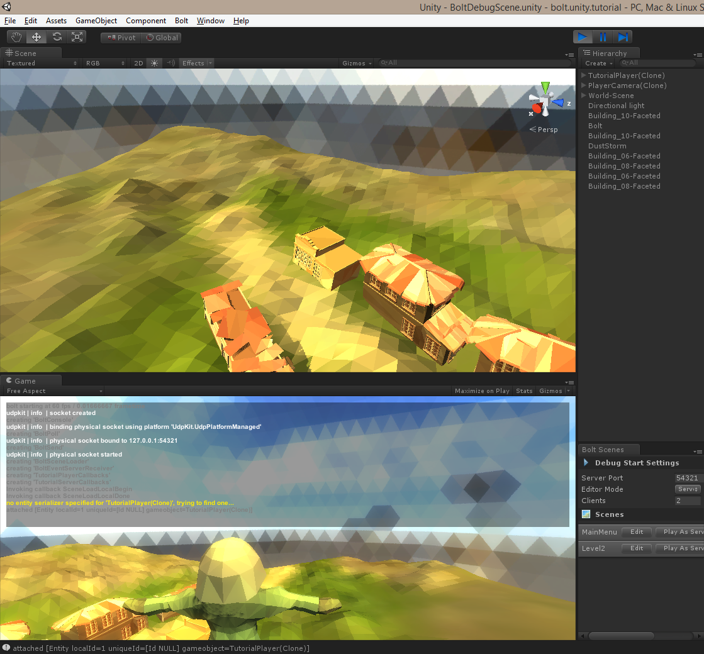
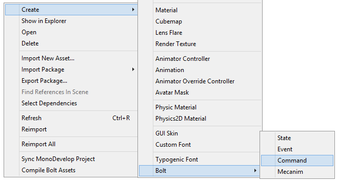
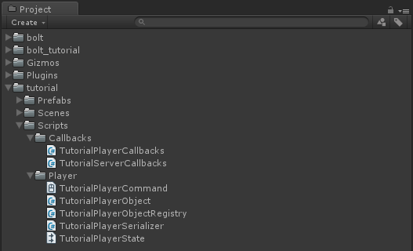
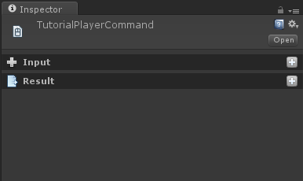
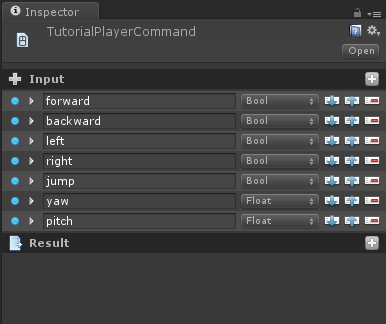

[<< Prev Chapter](chapter2.md)

# Chapter 3

In this chapter we will handle taking control of entities and moving around in the world, this will familiarize you with how the *control* concept in Bolt works and how it handles authoritative movement.  

## Hiding server and client differences

Before we go onto taking control of our entities we are going to deal with and explain something which comes up a lot when dealing with both Bolt and multiplayer in general.

**The problem:** *If we want let the server be just another player in the game, how do we deal with the fact that the server doesn't exist as a connection on itself?*

Each client that connects to the server is represented by a `BoltConnection` object and on each client the server is represented as a single `BoltConnection` object. However when we want to do something to the "server player" on the server itself we have no easy way to refer to it, since there is no object which represents the server on itself.

The answer to this is that we need to create a simple abstraction, which lets us deal with a *Player* object instead of a specific connection, in this player object we will hide if we have a connection or not, so that the rest of our code does not have to think about it.

Create two new C# files and call them *TutorialPlayerObject.cs* and *TutorialPlayerObjectRegistry.cs*. Let's start in the `TutorialPlayerObject` class.

```csharp
public class TutorialPlayerObject {
  public BoltEntity character;
  public BoltConnection connection;
}
``` 

The is a standard C# class, it does **not** inherit from unitys `MonoBehaviour` class. This is very important. It also contains two fields called `character` and `connection`. The `character` field will contain the instantiated object which represents the players character in the world. The `connection` field will contain the connection tho this player **if one exists**, this will be `null` on the server for the servers player object.

We are going to add two properties also, which lets us check if this is a client or a server player object without having to deal with the `connection` field directly.

```csharp
public class TutorialPlayerObject {
  public BoltEntity character;
  public BoltConnection connection;

  public bool isServer {
    get { return connection == null; }
  }

  public bool isClient {
    get { return connection != null; }
  }
}
``` 

`isServer` and `isClient` simply check if the connection is or isn't null, which tells us if the player represents the server or a client. Before we add more functionality to our `TutorialPlayerObject` we are going to open up the `TutorialPlayerObjectRegistry` class. We are using this class for managing instance of our `TutorialPlayerObject` class.

The only thing in this entire class which isn't just standard C# code is that we are accessing the `userToken` property on the `BoltConnection` class. This property is simply a place where you can stick any type of other object/data that you want to pair with the connection. In our case we are going to pair the `TutorialPlayerObject` we create with the connection it belongs to (if it belongs to one). 

The remainder of this class contains very little which is specific to Bolt, if you want read through the code and comments below but we're not going to go into more detail on it.


```csharp
using System.Collections.Generic;
using System.Linq;

public static class TutorialPlayerObjectRegistry {
  // keeps a list of all the players
  static List<TutorialPlayerObject> players = new List<TutorialPlayerObject>();

  // create a player for a connection
  // note: connection can be null
  static TutorialPlayerObject CreatePlayer(BoltConnection connection) {
    TutorialPlayerObject p;

    // create a new player object, assign the connection property
    // of the object to the connection was passed in
    p = new TutorialPlayerObject();
    p.connection = connection;

    // if we have a connection, assign this player 
    // as the user token for the connection so that we
    // always have an easy way to get the player object 
    // for a connection
    if (p.connection != null) {
      p.connection.userToken = p;
    }

    // add to list of all players
    players.Add(p);

    return p;
  }

  // this simply returns the 'players' list cast to 
  // an IEnumerable<T> so that we hide the ability 
  // to modify the playe rlist from the outside.
  public static IEnumerable<TutorialPlayerObject> allPlayers {
    get { return players; }
  }

  // finds the server player by checking the 
  // .isServer property for every player object.
  public static TutorialPlayerObject serverPlayer {
    get { return players.First(x => x.isServer); }
  }

  // utility function which creates a server player
  public static TutorialPlayerObject CreateServerPlayer() {
    return CreatePlayer(null);
  }

  // utility that creates a client player object.
  public static TutorialPlayerObject CreateClientPlayer(BoltConnection connection) {
    return CreatePlayer(connection);
  }

  // utility function which lets us pass in a 
  // BoltConnection object (even a null) and have 
  // it return the proper player object for it.
  public static TutorialPlayerObject GetTutorialPlayer(BoltConnection connection) {
    if (connection == null) {
      return serverPlayer;
    }

    return (TutorialPlayerObject)connection.userToken;
  }
}
```

Open up the *TutorialServerCallbacks.cs* file an update the class we have in there, remove the two calls to `BoltNetwork.Instantiate`. 

Implement the unity `Awake` function and call `TutorialPlayerObjectRegistry.CreateServerPlayer` inside it, this creates the server player for us whenever this callback object becomes active.

Also in `TutorialServerCallbacks` override the method called `ClientConnected` which is inherited from `BoltCallbacks`. Inside of it call `TutorialPlayerObjectRegistry.CreateClientPlayer` and pass in the connection argument.

```csharp
using UnityEngine;

[BoltGlobalBehaviour(BoltNetworkModes.Server)]
public class TutorialServerCallbacks : BoltCallbacks {
  void Awake() {
    TutorialPlayerObjectRegistry.CreateServerPlayer();
  }

  public override void ClientConnected(BoltConnection arg) {
    TutorialPlayerObjectRegistry.CreateClientPlayer(arg);
  }

  public override void SceneLoadLocalDone(string map) {
  }

  public override void SceneLoadRemoteDone(BoltConnection connection, string map) {
  }
}

```

It's finally time to spawn the characters for each of our players and also assign control of them correctly, open up the `TutorialPlayerObject` class again and we are going to add two new methods: `Spawn` and `RandomPosition`. `Spawn` will spawn our character and `RandomPosition` simply picks a random position in the world to spawn at.

```csharp
using UnityEngine;
using System.Collections.Generic;

public class TutorialPlayerObject {
  public BoltEntity character;
  public BoltConnection connection;

  public bool isServer {
    get { return connection == null; }
  }

  public bool isClient {
    get { return connection != null; }
  }

  public void Spawn() {
    if (!character) {
      character = BoltNetwork.Instantiate(BoltPrefabs.TutorialPlayer);

      if (isServer) {
        character.TakeControl();
      } else {
        character.GiveControl(connection);
      }
    }

    // teleport entity to a random spawn position
    character.Teleport(RandomPosition());
  }

  Vector3 RandomPosition() {
    float x = Random.Range(-32f, +32f);
    float z = Random.Range(-32f, +32f);
    return new Vector3(x, 32f, z);
  }
}
```

I wont explain `RandomPosition` as it simply returns a random vector (position) in the world, but let's look closer at the `Spawn` function. In `Spawn` we first check if we have a character or not and if we **dont** have one we call `BoltNetwork.Instantiate` and create one. Then we simply check if we are the server or not and call the proper method for taking or giving control.

We then simply call the `Teleport` function on the character object which moves our player to a random position in the world.

Before we start our game, there is two more things we need to handle. First open up the `TutorialPlayerCallbacks` class found in *tutorial/Scripts/Callbacks*. We are going to override a callback called `ControlOfEntityGained` which notifies us of when we get control of an entity.

```csharp
using UnityEngine;

[BoltGlobalBehaviour]
public class TutorialPlayerCallbacks : BoltCallbacks {
  public override void SceneLoadLocalDone(string map) {
    // this just instantiates our player camera, 
    // the Instantiate() method is supplied by the BoltSingletonPrefab<T> class
    PlayerCamera.Instantiate();
  }

  public override void ControlOfEntityGained(BoltEntity arg) {
    // this tells the player camera to look at the entity we are controlling
    PlayerCamera.instance.SetTarget(arg);
  }
}
```

The last thing we need to do is go back to the `TutorialServerCallbacks` and call the `Spawn` method when we are done loading the scene, since this behaviour exists on the server (courtesy of the `[BoltGlobalBehaviour(BoltNetworkModes.Server)]` attribute) we need to check both for the *SceneLoadLocalDone* for the server itself and for the *SceneLoadRemoteDone* for the clients.

```csharp
using UnityEngine;

[BoltGlobalBehaviour(BoltNetworkModes.Server)]
public class TutorialServerCallbacks : BoltCallbacks {
  void Awake() {
    TutorialPlayerObjectRegistry.CreateServerPlayer();
  }

  public override void ClientConnected(BoltConnection arg) {
    TutorialPlayerObjectRegistry.CreateClientPlayer(arg);
  }

  public override void SceneLoadLocalDone(string map) {
    TutorialPlayerObjectRegistry.serverPlayer.Spawn();
  }

  public override void SceneLoadRemoteDone(BoltConnection connection, string map) {
    TutorialPlayerObjectRegistry.GetTutorialPlayer(connection).Spawn();
  }
}
```

If you go to the *Bolt Scenes* window and click *Play As Server* you will see a screen like the one below.



We have spawned our character, we have been assigned control of it and the camera is looking at it. Next up is moving around and controlling our character. You can also build a separate client and connect to the server you are starting in the editor with it, you will see that the client gets spawned properly and assigned a character just like the server is.

**Note:** *Due to the way the camera code works you can not rotate it around your character, it's completely static if the character is not moving, this is intentional*

## Movement

This section of the tutorial deals with something a lot of people ask about: Authoritative movement with client side prediction for instant movement on the clients that is still controlled and verified by the server. It also does this completely transparently and removes the differences between being a *client* and a *server* from movement codes point of view.

We are going to start by creating a *Bolt Command*, we're putting it in the tutorial/Scripts/Player folder and calling it *TutorialPlayerCommand*, right click on the *Player* folder and navigate *Create/Bolt/Command* to create one. 





If you select the command you will see it's inspector. Right now there's not much here except two headers saying *Input* and *Result*



Before we start adding properties to our command, let's go into detail on exactly what *Input* and *Result* represents. 

**Input** in general terms encapsulates player input from one player. This is often something like *"Forward"* and *"Backward"* for movement, or *"YRotation"* and *"XRotation"* for mouse rotation. But it can also be a bit more abstract such as *"SelectedWeapon"*.

**Result** encapsulate the state which is the result of applying the **Input** to your object, common properties here are values for *position* and *velocity* but also flags for different types of state as *isGrounded*, etc.

With this in mind, let's start adding some input to our command. We want the following **input** properties.

* **forward** - Bool. If we are holding down the forward key.
* **backward** - Bool. If we are holding down the backward key.
* **left** - Bool. If we are holding down the left key.
* **right** - Bool. If we are holding down the right key.
* **jump** - Bool. If we pressed the down the jump key.
* **yaw** - Float. Our current rotation on the Y axis.
* **pitch** - Float. Our current rotation on the X axis.



The **result** state of applying our input is represented by the following four properties.

* **position** - Vector3.
* **velocity** - Vector3.
* **isGrounded** - Bool. If we are touching the ground or not.
* **jumpFrames** - Byte. This one is a bit tricky to explain, but it basically counts how many "frames" we have left of applying our jump force on. This is a detail specific to the character motor we will be using.

[Next Chapter >>](chapter4.md)