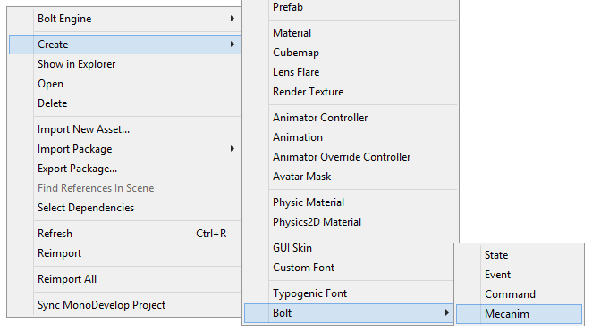
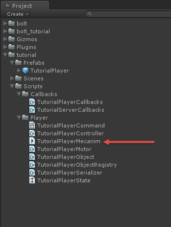
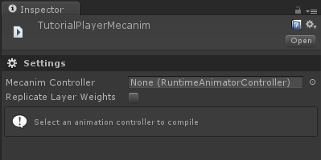
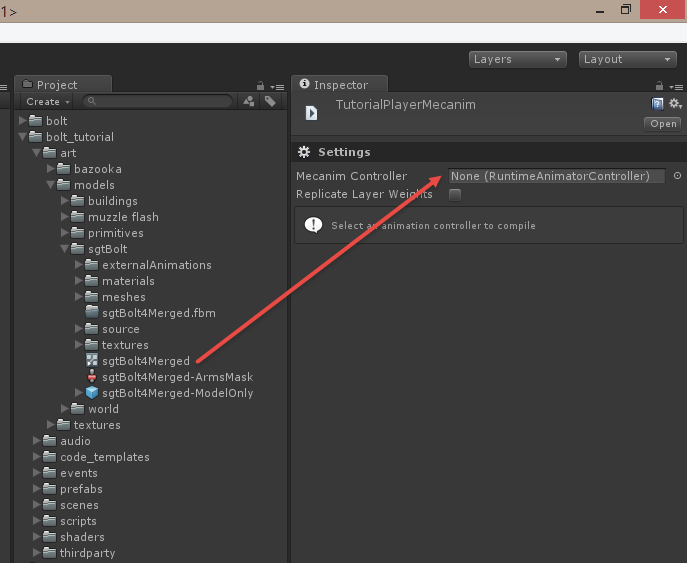
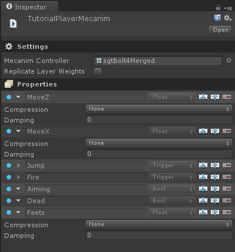
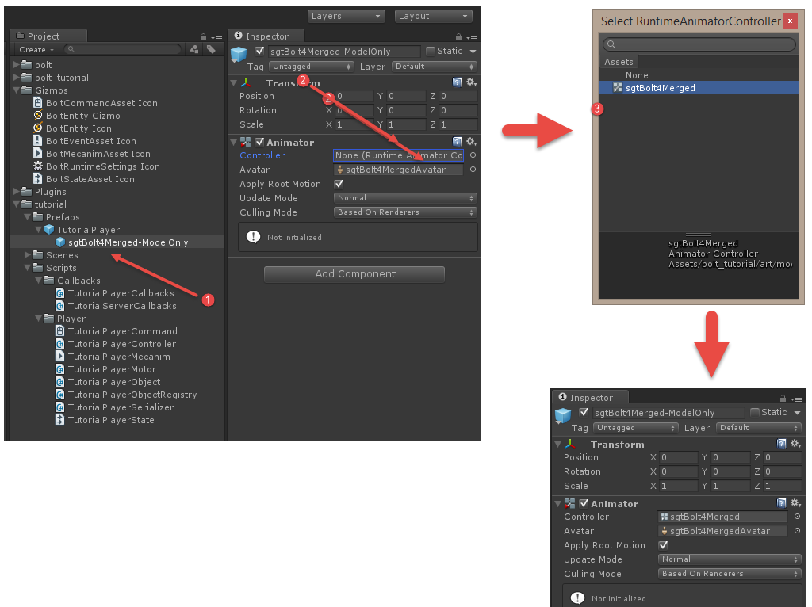
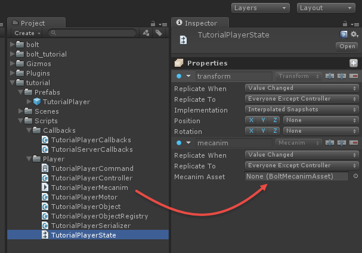
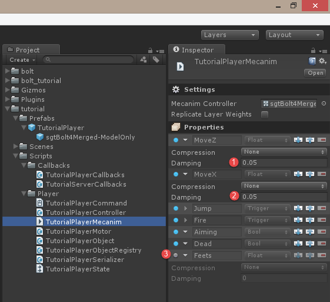

[<< Prev Chapter](chapter3.md)

# Animations (Mecanim)

In this chapter we will explain how to replicate animations over the networking using Bolt. There are many ways to do this, even many ways inside Bolt, we are going to look at the *default* way of replicating mecanim parameter state over the network. This chapter will be rather short, as there is not that much to write about mecanim replication, but it's such an important topic that it deserves its own chapter.

## Creating a mecanim asset

The first thing we are going to do is to create a Bolt Mecanim Asset, right click on the *tutorial/Scripts/Player* folder and select *Create/Bolt/Mecanim* to create a new asset, name it *TutorialPlayerMecanim*.





If you select our *TutorialPlayerMecanim* asset, you will see two options.

* **Mecanim Controller** is the mecanim controller we want to replicate.
* **Replicate Layer Weights** lets us replicate mecanim layer weights; this is a simple on/off toggle.



Find the mecanim controller for our player mesh, it's located in *bolt_tutorial/art/models/sgtBolt* and called *sgtBolt4Merged*, drag it into the *Mecanim Controller* slot on our *TutorialPlayerMecanim* asset.



As soon as you drop the mecanim controller in the correct slot you will see that Bolt detects all of the mecanim properties on the controller.



We also need to hook up our *sgtBolt4Merged* mecanim controller to our prefab; on our *TutorialPlayer* prefab in *tutorial/Prefabs* expand it and find the *sgtBolt4Merged-ModelOnly* child to it. Make sure to add the *sgtBolt4Merged* mecanim controller to its *Animator* component.
 


Find our *TutorialPlayerState* asset, located in *tutorial/Scripts/Player* and select it. Now drag the *TutorialPlayerMecanim* asset into the *Mecanim Asset* slot on the *TutorialPlayerState* asset.



We are almost done, it's time to compile Bolt again, go to *Assets/Bolt Engine/Compile Assets* and let Bolt do it's thing. Now open up the *TutorialPlayerController.cs* script.

We are going to add a new method called *AnimatePlayer*, its pretty much standard mecanim code where we set a MoveZ parameter to -1 or +1 depending on if we are moving forward/backward and the same with MoveX for left/right. 

```csharp

  void AnimatePlayer(TutorialPlayerCommand cmd) {
    // FWD <> BWD movement
    if (cmd.input.forward ^ cmd.input.backward) {
      state.mecanim.MoveZ = cmd.input.forward ? 1 : -1;
    }
    else {
      state.mecanim.MoveZ = 0;
    }

    // LEFT <> RIGHT movement
    if (cmd.input.left ^ cmd.input.right) {
      state.mecanim.MoveX = cmd.input.right ? 1 : -1;
    }
    else {
      state.mecanim.MoveX = 0;
    }

    // JUMP
    if (_motor.jumpStartedThisFrame) {
      state.mecanim.Jump();
    }
  }

```

Inside of the `ExecuteCommand` function we are going to call our new `AnimatePlayer` function, we are going to access a very specific property on our command called `isFirstExecution`. If this is true that means that this is the first time this command is being executed.

```csharp

  public override void ExecuteCommand(BoltCommand c, bool resetState) {
    TutorialPlayerCommand cmd = (TutorialPlayerCommand)c;

    if (resetState) {
      // we got a correction from the server, reset (this only runs on the client)
      _motor.SetState(cmd.state);
    }
    else {
      // apply movement (this runs on both server and client)
      cmd.state = _motor.Move(cmd.input);

      if (cmd.isFirstExecution) {
        AnimatePlayer(cmd);
      }
    }
  }

```

If this is the first time this command executes, we want to apply our animations. You can start the game and run around with our character now, you can choose to just *Play As Server* or also connect clients if you want.

We are going to tweak a couple of things before we are done. If you tested the game you will see that our characters animations are super snappy, and it doesn't look that good. We are also getting an error in the unity console.

```
Parameter 'Hash -785725318' is controlled by a curve.
```

Select our *TutorialPlayerMecanim* asset. On the *MoveZ* and *MoveX* properties add a damping of 0.05. The warning above comes from the fact that we have an animation curve setup inside mecanim as a parameter, and Bolt is trying to replicate that. Disable the 'Feets' property by clicking on the little light on the left side.



Now you should be able to play, the animations will transition smoother no more warnings! 

[Next Chapter >>](chapter5.md)
