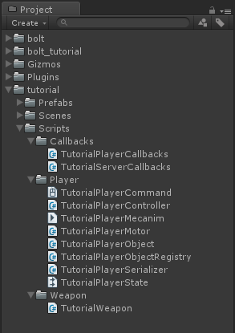
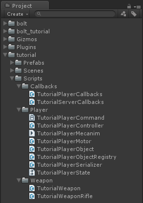
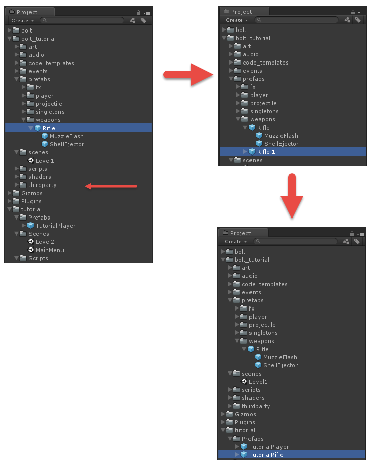
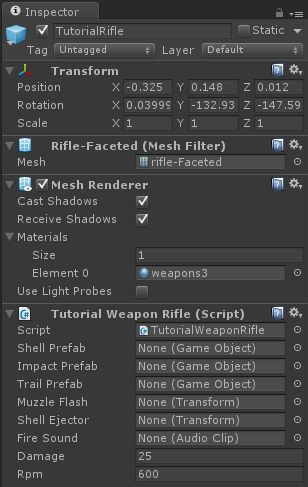
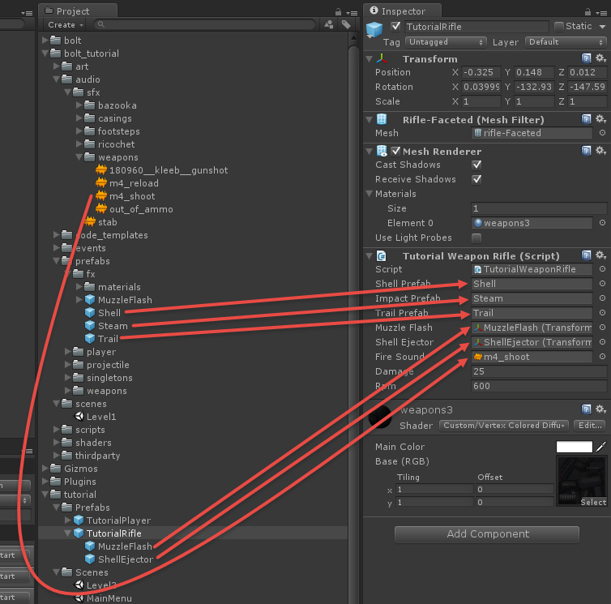
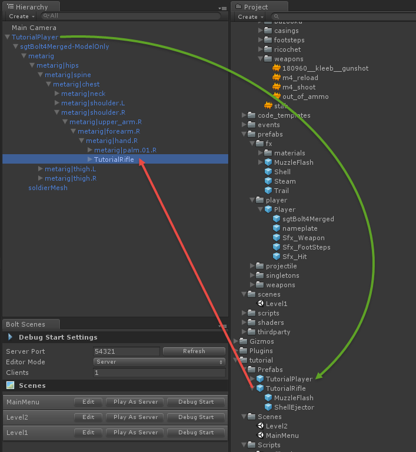
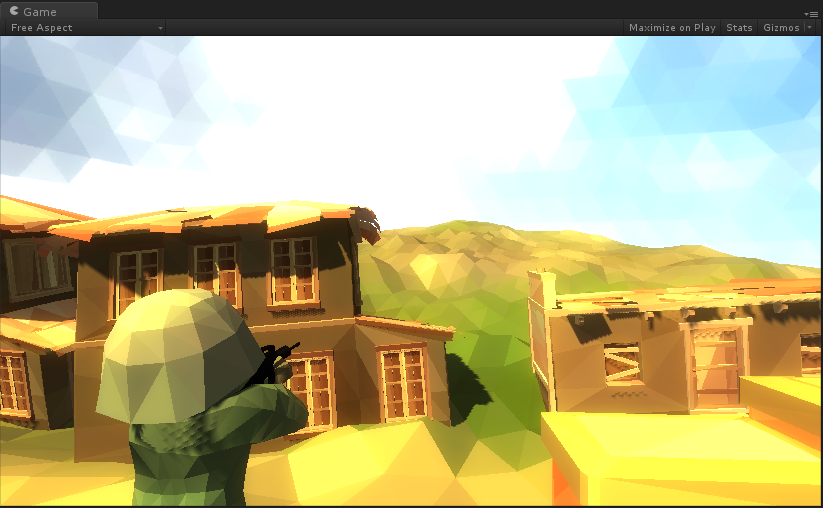
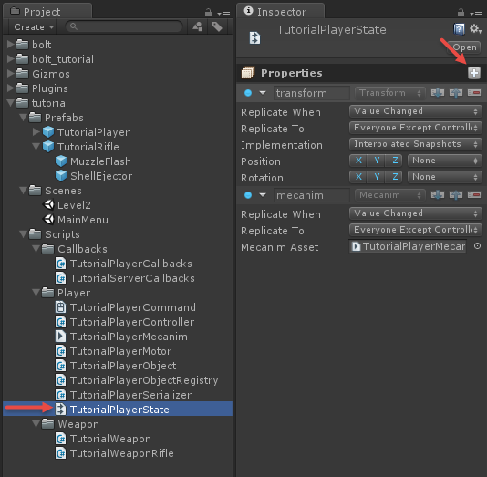
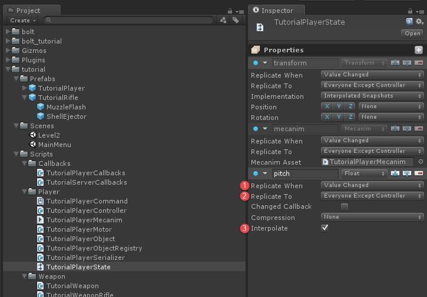

## Authoritative Lag Compensated Shooting

The title is quite a mouthful, but so is what we are going to implement. The following chapter will handle one of those "holy grail" style things of network programming. We are going to demonstrate several key things.

1. Authoritative weapon switching
2. Authoritative shooting 
3. Lag compensation on clients

# Guns, guns and more guns!

The first thing we are going to do is to set up a little bit of a generic *Weapon* component, create a new folder called *Weapons* in *tutorial/Scripts* and inside that create a new C# script called *TutorialWeapon.cs*.



Inside this script we are going to put a pretty standard unity mono behaviour, which is just going to have some variables for configuring our weapon, as this is pretty much standard Unity stuff we will not go into more details on it here. We will end up using all of these variables during the tutorial, so they will all be explained individually.

```csharp
using UnityEngine;

public abstract class TutorialWeapon : MonoBehaviour {
  [SerializeField]
  public GameObject shellPrefab;

  [SerializeField]
  public GameObject impactPrefab;

  [SerializeField]
  public GameObject trailPrefab;

  [SerializeField]
  public Transform muzzleFlash;

  [SerializeField]
  public Transform shellEjector;

  [SerializeField]
  public AudioClip fireSound;

  [SerializeField]
  public byte damage = 25;

  [SerializeField]
  public int rpm = 600;

  public int fireIntervall {
    get {
      // calculate rounds per second
      int rps = (rpm / 60);

      // calculate frames between each round
      return BoltNetwork.framesPerSecond / rps;
    }
  }

  public int fireLastFrame {
    get;
    set;
  }

  public virtual void HitDetection(TutorialPlayerCommand cmd, BoltEntity entity) {

  }

  public virtual void DisplayEffects(BoltEntity entity) {

  }
}
```

The next thing we are going to do is to create one more script, right next to our *TutorialWeapon*, and call it *TutorialWeaponRifle*. 



For now this is going to be mostly empty and simply inherit from our *TutorialWeapon* class.

```csharp
using UnityEngine;
using System.Collections;

public class TutorialWeaponRifle : TutorialWeapon {

}
```

Go into the *bolt_tutorial/prefabs/weapons* folder and find the *Rifle* prefab, create a duplicate of it (CTRL+D on Windows, CMD+D on OS X). The duplicate will be called "Rifle 1", drag it into our *tutorial/Prefabs* folder and rename it to *TutorialRifle*.



Select our new *TutorialRifle* prefab and add our *TutorialWeaponRifle* script to it.



lets hook up all of the public variables on the *TutorialWeaponRifle* through the inspector, instead of trying to explain exactly what goes where, here's a picture on how to hook everything up properly.



Time to get our little soldier to hold his weapon. The rifle *should* be rotated properly and you should just have to drop your *TutorialRifle* prefab it under his right hand like below (red arrow), don't forget to save the *TutorialPlayer* prefab by either clicking *Apply* or dragging it back on-top itself in the *Project* window (green arrow).
 


If you play the game you should see the rifle in your characters hands, if it is rotated incorrectly go back to the *TutorialPlayer* prefab and re-adjust it. 
 


As you might have noticed it is not possible to pitch the camera, this is simply because we have made the *PlayerCamera* class we are working generic enough to work with the tutorial code in it's non-finished state. First we need to add a *pitch* property to our *TutorialPlayerState* asset.



Name the property "pitch", make sure the type is Float. Configure it accordingly.

1. **Replicate When** set to *Value Changed*
2. **Replicate To** set to *Everyone Except Controller*
3. **Interpolate** enabled 



Time to compile Bolt, click to *Assets/Bolt Engine/Compile Assets*. Let Bolt do it's magic and then open up the *TutorialPlayerController* script. We are going to update the `ExecuteCommand` method, inside the if-block protected by the `cmd.isFirstExecution` check we're going to add a line which copies the pitch from our command into our state. 

```csharp
// ... 

if (cmd.isFirstExecution) {
  AnimatePlayer(cmd);

  // set state pitch
  state.pitch = cmd.input.pitch;
}

// ... 
```  

We can then go to our *TutorialPlayerCallbacks* script, and updated the `ControlOfEntityGained` method so it looks like this.

```csharp
// ... 

public override void ControlOfEntityGained(BoltEntity arg) {
    // this tells the player camera to look at the entity we are controlling
    PlayerCamera.instance.getPitch = () => arg.GetBoltState<ITutorialPlayerState>().pitch;
    PlayerCamera.instance.SetTarget(arg);
}

// ... 
``` 

The reason for this little roundabout way of getting the pitch into the camera is so that the camera can work without having all of the states compiled from the beginning, it allows us to progress in the tutorial in a more natural way.